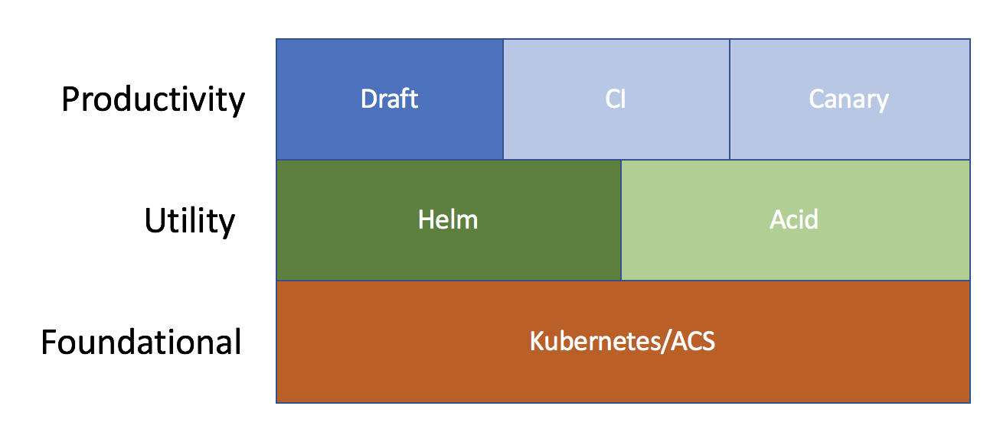
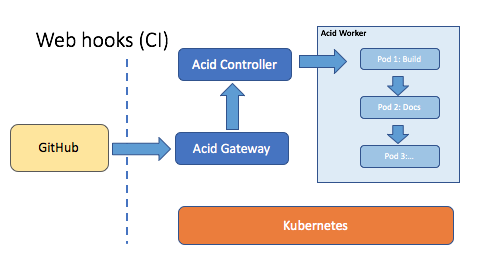

# Brigade Design

This is a high-level explanation of the design of Brigade.

Brigade is an in-cluster runtime environment. It is the basis for systems like CI or CD as well as systems that need in-cluster event handling.

It is designed to:

- run on top of Kubernetes
- be complimentary to Helm
- open an avenue for advanced Kubernetes workflows
  - continuous integration
  - continuous delivery



## Terminology

- **Brigade** is the main server. It is designed to run in-cluster as a deployment.
- **BrigadeIC**: Brigade _integration container_ is a container for running a job.
- **Brigade.js**: A JavaScript file that contains an Brigade configuration. Pronounced
  "Brigade Jay Es" or "Brigade Jazz".
- **Job**: A build unit, comprised of one or more build steps called "tasks"
- **Webhook**: An incoming request from an external SCM that provides a JSON
  payload indicating that a new contribution has been made. This triggers an
  Brigade run.
- **Project**: A named collection of data that Brigade operates on, e.g. a GitHub
  repository with source code in it.

## Components

Brigade is composed of the following pieces:

- The Brigade server
- BrigadeIC images (brigade-ubuntu, brigade-go,...)
- The Brigade.js supporting libraries (runner.js, quokka)
- The Brigade Helm chart (installs Brigade into Kubernetes)
- The Brigade Project Helm Chart (add or manage a project in an Brigade server)

The Brigade server is the main server that exposes webhook and other web APIs and triggers script runs.

Brigade scripts (brigade.js + supporting) run cluster-wide scripts. Just as the constituent parts of a shell script are the UNIX commands, the constituent parts of an Brigade script are containers (running in pods). And BrigadeIC image is just a docker container image that understands how to interoperate with specific Brigade components. However, regular container images work just fine.

Brigade is installed using a Helm chart. Brigade projects, which hold configuration data for Brigade, are also installed as charts (though they are just configmaps).

## High-Level Flow

At a high level, Brigade can handle different sorts of requests. To provide a simple example, here is a GitHub workflow:


GitHub hosts a number of projects. Our team has configured two Brigade projects (`github.com/technosophos/example` and `github.com/helm/otherexample`). Likewise, GitHub has been configured to trigger an Brigade build, via webhook, whenever a pull request is received.

1. Event: Github sends a webhook to Brigade. Brigade authenticates the request.
2. Load Config: Brigade loads the configuration for the given GitHub repository. This configuration
   may include credentials, special configuration directives, and settings or properties for the
   build.
3. Run: Brigade fetches the github repository, reads the `brigade.js` file, and then executes it. In the
  typical build scenario, this script will invoke one or more jobs (Kubernetes pods) that will build
  and test the code.
4. Notify: When the build is complete, Brigade will notify GitHub over the GitHub status API. It will
  send GitHub the state (success, failure, etc) along with a link where the user can fetch the logs

The workflow above can be expressed as a series of events.
When a GitHub project is configured to send webhooks to Brigade, it will send one
hook request per `push` event.


A hook kicks of an Brigade build, which in turn will invoke the repository's `brigade.js` file. The build is done inside of Kubernetes, with each `Job` being run as a Kubernetes pod.

Finally, the above can be generalized to a broader pattern. Along with doing GitHub CI operations, Brigade can be configured to react to other events.


The above shows other examples of event emitters that Brigade could listen for:

- VS Teams: Much the same as Github. And services such as BitBucket could be supported as well.
- Repository Watcher: Watch a Helm chart repository for a change in the chart version, and notify Brigade.
  A given `brigade.js` may then react by doing a rolling deployment, a stage deployment, etc.
- Docker Registry Watcher: Trigger an Brigade event when a docker image version changes.
- Cron Watcher: Trigger an Brigade event periodically.

In all cases, the watchers _trigger events_, and Brigade determines what to do based on the `brigade.js` configuration. To that end, it may be useful to think of Brigade as an event watching system or an implementation of a observer pattern.

## Details: The Servers

Brigade has three in-cluster components:

- `brigade-gateway` listens to external events (GitHub webhooks, DockerHub webhooks, etc) and converts them to Kubernetes resources.
- `brigade-controller` is a Kubernetes Controller that watches for certain resources, and starts new builds
- `brigade-worker` runs one (and only one) build. Controllers start new workers, which live for the duration of the build.

This section describes how the servers responds to a GitHub pull request or push operation.



When a Webhook `push` event is triggered, the Brigade gateway will do the following:

- Load the data provided by the webhook
- Load the project configuration.
  - A configuration has the following:
    - A project name
    - The GitHub URL
    - A GitHub shared secret used for authenticating a webhook request
    - (Optional) An SSH key that Brigade can use to securely fetch code from a private GitHub repo
    - (Optional) An OAuth2 token that Brigade can use to send upstream status messages to GitHub
  - If a request comes in for a project that does not match any of the configurations,
    Brigade returns an error.
- Perform auth against the original payload
  - AuthN is done using GitHub's hook auth mechanism -- a cryptographic hash with
    an agreed-upon secret salt.
  - If auth fails, Brigade returns an error
- Clone the GitHub repo (or update if the repo is cached)
  - By default, clone over HTTPS
  - Private repos clone over SSH with an SSH key
- Find and load the brigade.js file
  - brigade.js must be at the repository root
  - if no file is found, Brigade returns an error
- Generate a build ID
- Store the information in a new Secret

At this point, the Brigade controller will observe the new secret, and it will:

- Load the secret
- Perform some consistency checks
- Start a new Brigade worker

The new Brigade worker is responsible for executing the brigade.js file:

- Prepare the JavaScript runtime (sandboxed; one per request; never re-used)
- Run the brigade.js file
  - For each Brigade `Job`, create a config map and a pod.
  - The config map stores instructions on what to execute.
  - The pod mounts the config map as a volume
  - Run until the script is complete. Most jobs are blocking, but jobs can be
    run in the background.
- Update the GitHub status for the commit or pull request
  - On error, report a failure and provide a URL for more info
  - On success, report success

This is the basic operation of Brigade for GitHub webhooks.

It's important to note that new webhook types can be added simply by creating a new
gateway for your particular webhook mechanism. While many of the services Brigade works
with provide webhook APIs, there is no reason why one could not, for example,
implement a gateway that accepted email messages or chat messages and sent a new
request to the controller.

### Project Configuration

In Brigade, each _project_ has a Kubernetes Secret that stores information about that project. An _brigade project_ corresponds roughly with the more common notion of a project in software development: a buildable unit of code (usually tracked in an SCM)

The outline of how this project is linked to GitHub is explained above. But that same project could be hooked up to other services. For example, to replicate the older idea of a "nightly build," an in-cluster cron service might trigger a build on a project.

_ALTERNATE DESIGN_: We could eliminate the idea of per-project configuration and instead only have a per-server configuration. In this case, credentials would be shared across multiple GitHub projects (as is the case with CircleCI and TravisCI). However, this might make it harder to retain per-project configurations.

## JavaScript and brigade.js

Brigade has [a full JavaScript engine](javascript.md) inside. This engine provides some supporting libraries to provide primitives for:

- Creating and managing jobs
- Accessing configuration
- Querying Kubernetes
- Performing basic concurrency tasks

It does _not_ allow loading of external JS via NPM or other JavaScript loaders.

The traditional Brigade.js JavaScript implements one or more _event handlers_.

```javascript
// This handles a Push webhook.
events.on("push",  function(brigadeEvent, project) {
  // Do some stuff
}
events.on("pull_request", function (e, p) {
  // Do something else
})
```

When the Brigade server receives an event, it will fire the corresponding hook in
the `brigade.js` file.
